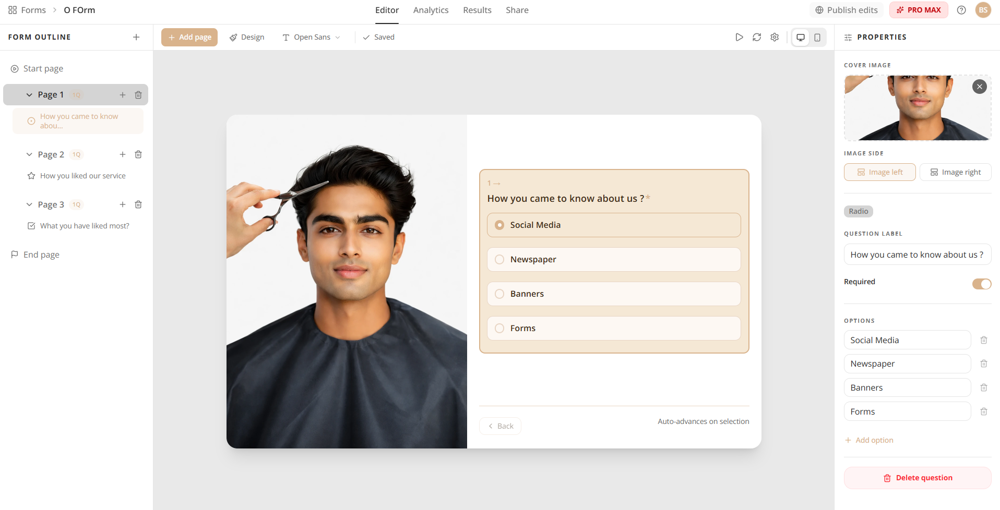

# Flowform

### Build beautiful forms. Understand your audience. Grow faster.

Flowform is a modern form builder that turns questions into conversations — helping you collect responses, analyze results, and make better decisions without any friction.

---

---

[✨ Features](#-features) · [🎨 Form Builder](#-form-builder) · [📊 Analytics](#-analytics) · [👥 Teams](#-teams) · [💎 Plans](#-plans)

---

## Why Flowform?

Most form tools feel like filling out tax documents. Flowform is different.

Whether you're running a survey, collecting feedback, onboarding new users, or running a quiz — Flowform makes the experience feel natural for your respondents, and the insights feel immediate for you. Two powerful layouts, beautiful themes, real-time analytics, and team collaboration — all in one place.

---

## ✨ Features

### 🎨 Form Builder

Build exactly the form you have in mind — no compromise.

**Two distinct form experiences:**

| Layout | Best for |
|---|---|
| **Vertical / List** | Long surveys, detailed questionnaires, multi-section forms |
| **Conversational / Card** | Lead gen, onboarding flows, quizzes, anything that feels like a chat |

**8 powerful field types:**

- **Short Text** — capture names, one-liners, free-form input
- **Email** — built-in validation, no extra config needed
- **Number** — set min/max ranges, collect scores or quantities
- **Date** — date picker with optional time, perfect for scheduling
- **Dropdown** — clean single-select from a list of options
- **Multiple Choice** — radio-style visible options, great for quick picks
- **Checkboxes** — let respondents pick everything that applies
- **Rating** — star ratings with configurable scale (3–10 stars)

**Page structure:**
- Customizable **Start Page** — set the tone with a heading, description, and call-to-action button
- Customizable **End Page** — close strong with a thank-you message, animated celebration (confetti, fireworks, balloons), and an optional redirect button
- **Multi-page support** — break long forms into digestible sections

**Building experience:**
- Drag-and-drop to reorder pages and questions instantly
- Real-time **desktop & mobile preview** — see exactly what your respondents will see
- Auto-saves as you type — never lose your work
- Form outline sidebar for a bird's-eye view of your entire form

---

### 🖌️ Design & Themes

Your form should look as good as your brand.

- Choose from a library of **pre-built themes** across all plans
- Unlock **premium and exclusive themes** on higher plans
- Full customization — colors, fonts, button shapes, input styles, and more
- **Live theme preview** so you see changes before going live

Customizable properties include: primary color, accent color, background, button radius (sharp / rounded / pill), font family, label colors, input borders, choice backgrounds, and star rating color.

---

### 📊 Analytics

Stop guessing. Start knowing.

Every form comes with a dedicated analytics dashboard that shows you:

**Top-level metrics at a glance:**
- Total views, starts, and submissions
- Completion rate
- Average time to complete

**Question-level insights:**
- Response distribution across all choice fields (dropdown, multiple choice, checkboxes)
- Option-by-option percentage breakdown
- Average ratings and star distribution for rating questions

**Audience insights:**
- Response volume over time
- Geographic data — top countries and cities your respondents come from

**Multi-version tracking:**
- Publish updates to your form without losing old data
- Filter analytics by specific published versions
- Compare how response patterns shift across versions

---

### 📬 Responses & Data

All your data, always within reach.

- View every submission in a clean, paginated response table
- Filter by form version to isolate specific data sets
- **Export to CSV** with a single click — formatted and ready for spreadsheets or further analysis
- Optionally **collect respondent emails** for follow-up

---

### ⚙️ Form Settings

Full control over how your form behaves.

**Response controls:**
- Set a response limit — automatically close the form when you've got enough
- Set an expiry date — stop collecting after a specific date (Pro+)
- Password-protect forms with an access code

**Completion behavior:**
- Redirect respondents to any URL when they finish (Pro Max)
- Send automatic confirmation emails to respondents (Pro Max) with custom subject and body

**Progress indicators:**
- Show respondents how far they've come — choose between a progress bar, step count, or percentage

**Branding:**
- Add your own logo and brand name to the form navbar (Pro+)
- Remove the Flowform watermark entirely (Pro Max)

**Localization:**
- Serve your form in 6 languages — English, Spanish, French, German, Portuguese, and Hindi (Pro+)
- Custom slug URLs instead of random IDs (Pro+)

---

### 👥 Teams & Collaboration

Build forms together, not in silos.

- Invite teammates by email with a custom role
- Three access levels: **Admin**, **Editor**, and **Viewer** — full control over who can do what
- Share an invite link directly for quick onboarding
- Track pending and active members from a central team page

---

### 🔒 Security & Access

Your data stays yours.

- Email/password authentication
- Optional access codes to gate form access
- Public or private form visibility toggle
- Role-based permissions across your workspace

---

## 💎 Plans

Choose the plan that fits where you are right now.

| | Free | Pro | Pro Max |
|---|:---:|:---:|:---:|
| Responses / month | 100 | 2,000 | 10,000 |
| Active forms | 5 | 20 | 50 |
| Team members | 1 | 10 | 30 |
| Analytics | Basic | Advanced | Advanced |
| Themes | Free | Free + Pro | Free + Pro + Pro Max |
| Custom slug URLs | — | ✓ | ✓ |
| Custom branding (logo + name) | — | ✓ | ✓ |
| Multi-language forms | — | ✓ | ✓ |
| Form close date | — | ✓ | ✓ |
| Remove Flowform watermark | — | — | ✓ |
| Redirect on completion | — | — | ✓ |
| Email confirmations to respondents | — | — | ✓ |
| **Price** | **Free** | **$10/mo** | **$25/mo** |

---

## 🗺️ What's Coming

- **Polls** — quick, lightweight votes and opinion gathering for teams *(coming soon)*

---

Start for free. Upgrade when you're ready.

**Flowform — forms that feel human.**

